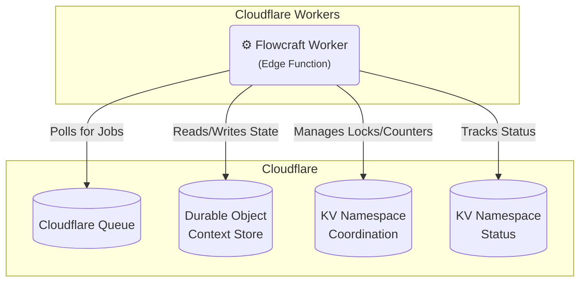

# Runtime Adapter: Cloudflare (Queues, Durable Objects & KV)

[](https://www.npmjs.com/package/@flowcraft/cloudflare-adapter)

This adapter provides a serverless-friendly solution for running distributed workflows on Cloudflare's edge network. It uses **Cloudflare Queues** for reliable job distribution, **Durable Objects** for state persistence, and **Cloudflare KV** for coordination.

## Installation

You will need the adapter package.

```bash
npm install flowcraft @flowcraft/cloudflare-adapter
```

## Architecture

This adapter leverages native Cloudflare services for all distributed concerns.



## Infrastructure Setup

You must have the following Cloudflare resources provisioned:

-   A **Cloudflare Queue** to handle jobs.
-   Two **KV Namespaces**:
    1.  For workflow **coordination** (locks, fan-in counters).
    2.  For workflow **status** tracking.
-   A **Durable Object** class for context persistence.

### Using Wrangler CLI

```bash
# 1. Create KV namespaces
wrangler kv:namespace create "flowcraft-coordination"
wrangler kv:namespace create "flowcraft-status"

# 2. Create a queue
wrangler queues create "flowcraft-jobs"

# 3. Create Durable Object
wrangler d1 create flowcraft-contexts  # Optional: for SQL-based context if needed
```

### Using Terraform

```hcl
resource "cloudflare_queue" "jobs" {
  name = "flowcraft-jobs"
}

resource "cloudflare_workers_kv_namespace" "coordination" {
  title = "flowcraft-coordination"
}

resource "cloudflare_workers_kv_namespace" "status" {
  title = "flowcraft-status"
}

resource "cloudflare_workers_script" "worker" {
  name = "flowcraft-worker"
  # ... other config
}
```

## Worker Usage

The following example shows how to set up a Cloudflare Worker that processes jobs from a queue.

### 1. Configure wrangler.toml

```toml
name = "flowcraft-worker"
main = "src/index.ts"
compatibility_date = "2024-01-01"

[[kv_namespaces]]
binding = "COORDINATION"
id = "your-coordination-namespace-id"

[[kv_namespaces]]
binding = "STATUS"
id = "your-status-namespace-id"

[[queues]]
binding = "JOBS"
queue = "flowcraft-jobs"
consumer_type = "http-pull"
```

### 2. Create the Worker

```typescript
import { CloudflareQueueAdapter, KVCoordinationStore, DurableObjectContext } from '@flowcraft/cloudflare-adapter'
import type { Queue } from '@cloudflare/workers-types'

export interface Env {
	COORDINATION: KVNamespace
	STATUS: KVNamespace
	JOBS: Queue
}

const blueprints = { /* your workflow blueprints */ }
const registry = { /* your node implementations */ }

export default {
	async queue(batch: MessageBatch, env: Env): Promise<void> {
		// Initialize the coordination store
		const coordinationStore = new KVCoordinationStore({
			namespace: env.COORDINATION,
		})

		// Create the adapter (one per worker instance)
		const adapter = new CloudflareQueueAdapter({
			runtimeOptions: {
				blueprints,
				registry,
			},
			coordinationStore,
			queue: env.JOBS,
			durableObjectStorage: env.durableObjectStorage,
			kvNamespace: env.COORDINATION,
			statusKVNamespace: env.STATUS,
			queueName: 'flowcraft-jobs',
		})

		// Process each message
		for (const message of batch.messages) {
			try {
				const job = message.body as { runId: string; blueprintId: string; nodeId: string }
				await adapter.handleJob(job)
				message.ack()
			} catch (error) {
				console.error('Failed to process job:', error)
				message.nack()
			}
		}
	},
}
```

## Durable Object Setup

For context persistence, you need to implement a Durable Object class that the adapter will use.

```typescript
export class FlowcraftContextDO implements DurableObject {
	async fetch(request: Request): Promise<Response> {
		return new Response('Flowcraft Context DO')
	}

	async initialize(): Promise<void> {
		// Initialize storage if needed
	}

	async get(key: string): Promise<unknown> {
		return this.storage.get(key)
	}

	async put(key: string, value: unknown): Promise<void> {
		await this.storage.put(key, value)
	}

	async delete(key: string): Promise<boolean> {
		return this.storage.delete(key)
	}

	async list(options?: { prefix?: string }): Promise<Map<string, unknown>> {
		return this.storage.list(options)
	}
}
```

## Starting a Workflow (Client-Side)

A client starts a workflow by initializing the context and sending the first job(s) to the queue.

```typescript
import { analyzeBlueprint } from 'flowcraft'

interface Env {
	COORDINATION: KVNamespace
	STATUS: KVNamespace
	JOBS: Queue
}

async function startWorkflow(env: Env, blueprint, initialContext) {
	const runId = crypto.randomUUID()

	// 1. Set initial status in KV
	await env.STATUS.put(runId, JSON.stringify({
		status: 'running',
		lastUpdated: Math.floor(Date.now() / 1000),
	}))

	// 2. Analyze blueprint for start nodes
	const analysis = analyzeBlueprint(blueprint)

	// 3. Enqueue start jobs to Cloudflare Queue
	for (const nodeId of analysis.startNodeIds) {
		await env.JOBS.send({
			runId,
			blueprintId: blueprint.id,
			nodeId,
		})
	}

	console.log(`Workflow ${runId} started.`)
	return runId
}
```

## Reconciliation

The adapter includes reconciliation capabilities to find and resume stalled workflows.

### Usage

```typescript
const adapter = new CloudflareQueueAdapter({
	// ... options
})

// Reconcile a specific run
const enqueuedNodes = await adapter.reconcile(runId)
console.log(`Reconciled ${enqueuedNodes.size} nodes for run ${runId}`)
```

The reconciliation process:
1.  Loads the workflow context from the Durable Object
2.  Identifies completed nodes
3.  Calculates the frontier (next executable nodes)
4.  Acquires distributed locks
5.  Re-enqueues jobs for ready nodes

## Testing

Unlike other adapters that use Docker-based Testcontainers, the Cloudflare adapter uses **Miniflare** for local testing.

### Unit Tests

Run unit tests with mocked Cloudflare APIs:

```bash
pnpm test:unit
```

### Integration Tests

Run integration tests using Miniflare:

```bash
CLOUDFLARE_API_TOKEN=your-token CLOUDFLARE_ACCOUNT_ID=your-account pnpm test:integration
```

## Key Components

-   **`CloudflareQueueAdapter`**: The main class that orchestrates job execution.
-   **`DurableObjectContext`**: An `IAsyncContext` implementation for storing state in Durable Objects.
-   **`KVCoordinationStore`**: An `ICoordinationStore` implementation using Cloudflare KV for distributed locking and fan-in counting.

## Webhook Endpoints

The Cloudflare adapter does not currently support webhook endpoint registration. This feature would typically be implemented using Cloudflare Workers' native HTTP handling.

## Differences from Other Adapters

| Feature | Cloudflare Adapter | Other Adapters |
|---------|-------------------|----------------|
| State Storage | Durable Objects | DynamoDB, Cosmos DB, Firestore |
| Coordination | KV | Redis, DynamoDB |
| Job Queue | Cloudflare Queues | SQS, Pub/Sub, RabbitMQ |
| Testing | Miniflare | Testcontainers |

## Limitations

-   Cloudflare Queues are currently in beta and may have feature limitations.
-   KV has eventual consistency - design coordination logic accordingly.
-   Durable Objects have per-request CPU and memory limits.
