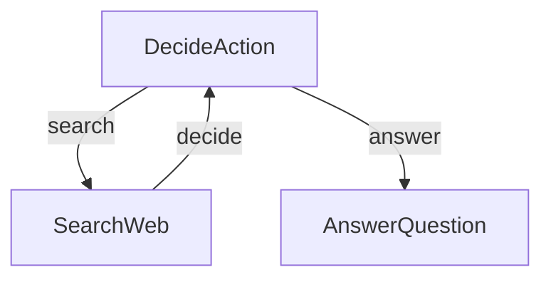

# Research Agent

This project demonstrates a simple yet powerful research agent that can search the web and answer questions. It uses conditional branching in `workflow` to decide its next action.

## Features

- Performs web searches to gather information.
- Makes decisions about when to search vs. when to answer.
- Generates comprehensive answers based on research findings.

## How to Run

1. **Install dependencies**:

    ```bash
    npm install
    ```

2. **Set your OpenAI API key**:
   Create a `.env` file in this directory or set an environment variable:

    ```
    OPENAI_API_KEY="your-api-key-here"
    ```

    You will also need a free API key from [SerpApi](https://serpapi.com/) for web search.

    ```
    SERP_API_KEY="your-serpapi-key-here"
    ```

3. **Run the application**:

    ```bash
    npm start -- "Who won the Nobel Prize in Physics 2024?"
    ```

## Security Note

This example uses `UnsafeEvaluator` in the runtime configuration because it requires complex expression evaluation for the loop condition (`loop_count < 2 && last_action !== 'answer'`). The `UnsafeEvaluator` allows JavaScript expressions but poses security risks if used with untrusted input.

For production use, consider implementing a custom evaluator using a sandboxed library like `jsep` for safer expression evaluation.

## How It Works

The agent uses a graph structure with a decision loop:


